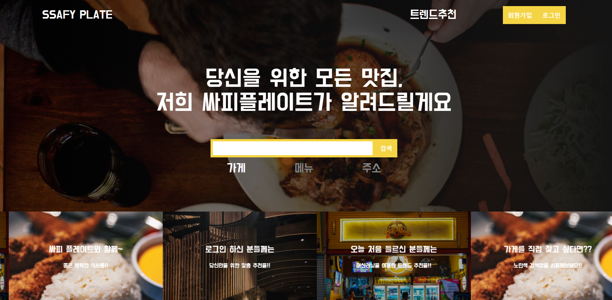
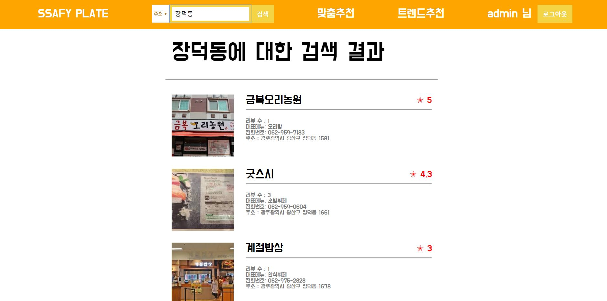
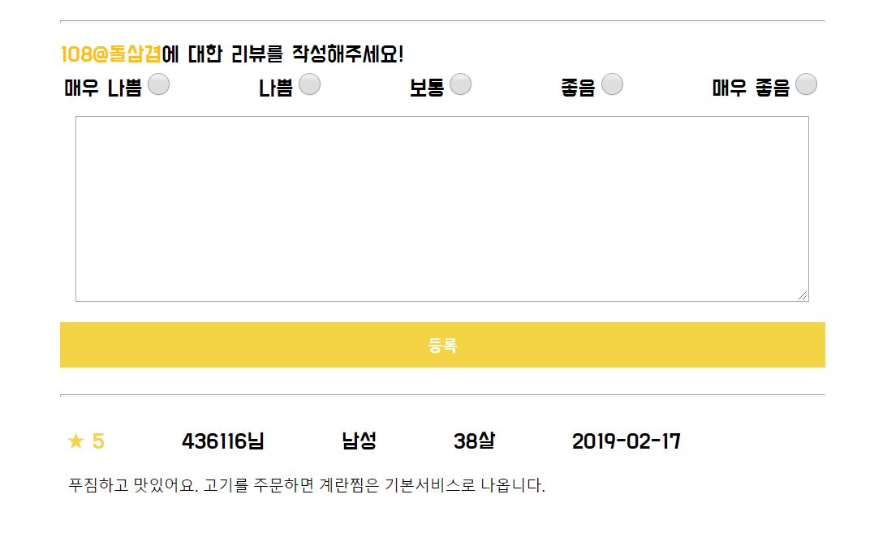
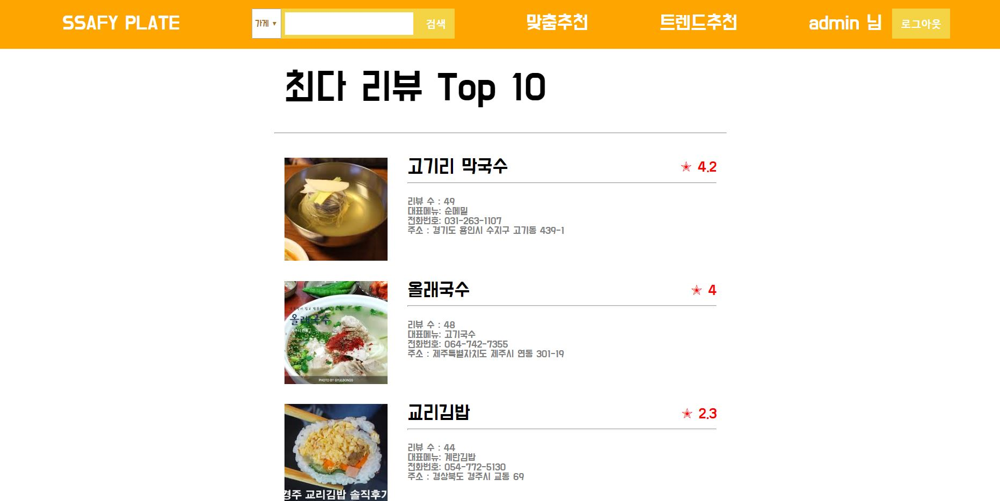
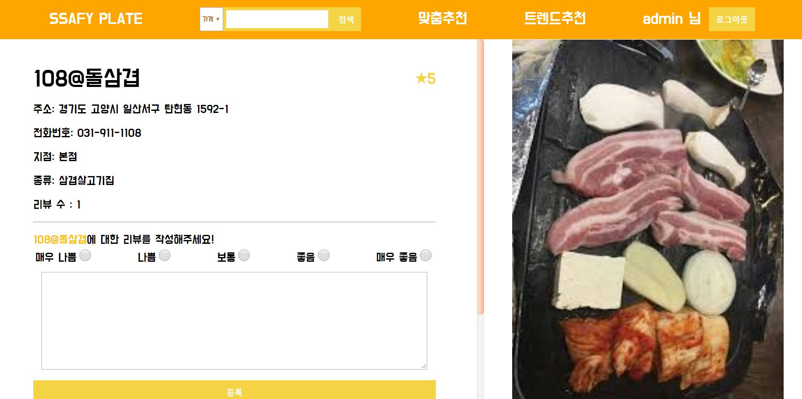
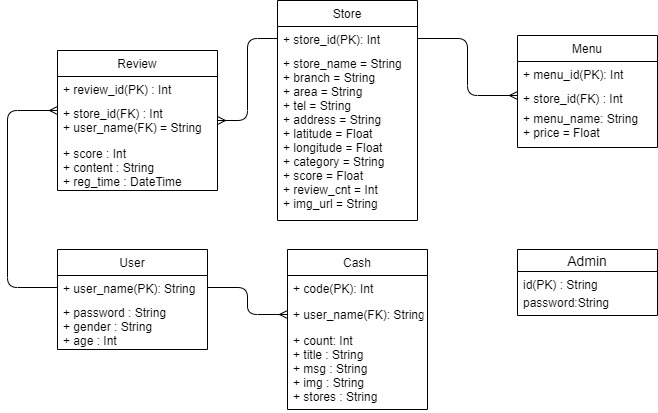

# :birthday: :lollipop: PLATE : Bigdata Project :dango: :hamburger:
### 음식점 45만건 데이터를 바탕으로, 개인별 맛집을 추천해주는 웹 사이트

## Service
* 빅데이터를 활용한 MF/K-means/KNN 추천 알고리즘 구현
* 구글 활용한 음식점 이미지 크롤링
* 방대한 데이터를 작은 단위로 Pagenation 구현
* Restful API 서버 구현
* 망고플레이트를 cloning한 클라이언트 디자인
* 추천 리스트 동적 화면 구성

## 1. 핵심 기능
### 1) 맛집 추천
* 해당 회원이 작성한 리뷰를 분석하여 자주 가는 지역의 맛집 추천(K-means)
* 해당 회원이 각 매장에 부여한 점수에 따라 유사 매장 분석 및 추천(MF)
* 유사 리뷰/성별/연령/자주 이용한 카테고리별 맛집 추천(한글 형태소 분석)


### 2) 맛집 검색
* 지역, 메뉴, 식당 이름으로 맛집 검색
* 트랜드 화면을 통해 현재 가장 인기있는 맛집 목록 구현


### 3) 리뷰 작성
* 로그인을 통해 해당 상점에 평점, 리뷰 등록
* 리뷰 삭제/수정/조회 기능


### 4) 음식 데이터 크롤링
* 구글을 활용한 음식 데이터 사진 크롤링


### 5) 음식점 정보 기능 구현
* 음식점 상세 정보, 리뷰 정보를 볼 수 있는 기능 구현
* 음식점의 평균 평점을 볼 수 있는 기능 구현


## 2. 사용 기술
### Django, numpy, scipy 및 React를 활용하여 개발
**Backend**
* Python : 3.6.8
* Django : 2.2.7
* djangorestframework : 3.10.3
* numpy : 1.17.3
* scipy : 1.3.1
* sqlparse : 0.3.0
* pandas : 0.25.3

**Frontend**
* React : 16.13.1

## 3. 개발 계획
* 진행 기간 : 2020.03 ~ 2020.05

## 4. DB 모델링
* DB 모델 설계 및 Pandas DataFrame DB 마이그레이션



## 5. 로컬 실행 방법

### Sub1

```sh
cd sub1
pip install -r requirements.txt
python parse.py
python analyse.py
python visualize.py
```

### Sub 2

**Backend**

```sh
cd sub2/backend
pip install -r requirements.txt
python manage.py makemigrations
python manage.py migrate
python manage.py initialize
python manage.py runserver
```

**Frontend**

```sh
cd sub2/frontend
npm install
npm run serve
```
